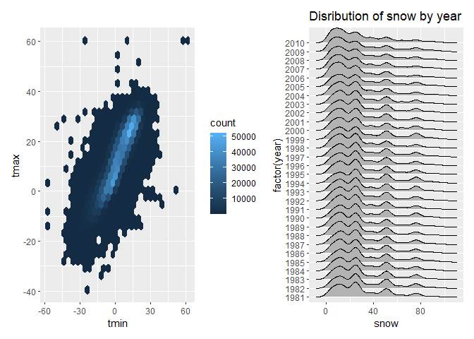

hw3
================
Senna
2024-10-12

Necessary packages are loaded.

``` r
library(tidyverse)
library(lubridate)
library(patchwork)
library(ggridges)
```

## Problem 1

``` r
library(p8105.datasets)
p1_df = ny_noaa
```

###### Do some data cleaning. Create separate variables for year, month, and day. Ensure observations for temperature, precipitation, and snowfall are given in reasonable units.

``` r
p1_df = p1_df|>
   separate(date, into = c("year", "month", "day"), sep = "-")|>
  mutate(
    tmax = (as.numeric(tmax))/10,
    tmin = (as.numeric(tmin))/10
  )
```

###### Ensure correct units.

``` r
summary_list = list(
  tmax = summary(na.omit(p1_df[["tmax"]])),
  tmin = summary(na.omit(p1_df[["tmin"]])),
  prcp = summary(na.omit(p1_df[["prcp"]])),
  snow = summary(na.omit(p1_df[["snow"]]))
)
summary_list
```

###### For snowfall, what are the most commonly observed values? Why?

``` r
snow_mode <- p1_df |>
  group_by(snow) |>
  summarize(count = n()) |>
  arrange(desc(count))

head(snow_mode,5)
```

    ## # A tibble: 5 × 2
    ##    snow   count
    ##   <int>   <int>
    ## 1     0 2008508
    ## 2    NA  381221
    ## 3    25   31022
    ## 4    13   23095
    ## 5    51   18274

The most commonly observed value was 0 since it is common for most days
to not have any snow. Followed by 0s and NA’s, the most common values
were 25, 13, and 51, in that order.

###### Make a two-panel plot showing the average max temperature in January and in July in each station across years. Is there any observable / interpretable structure? Any outliers?

``` r
p1_df |> 
  filter(month == c("01", "07")) |>
  drop_na(tmax, tmin) |>
  group_by(id, month, year) |> 
  mutate(
    mean_tmax = mean(tmax, na.rm = TRUE)
  ) |> 
  ggplot(aes(x = id, y = mean_tmax, color = year)) + 
  geom_point(aes(group = year), alpha = 0.5) +
  facet_grid(~month) +
  labs(
    title = "Mean Maximum Temperature in January and July",
    x = "Station ID",
    y = "Mean Maximum Temperature (C)"
) +
  theme_minimal()
```

<!-- --> The
mean maximum temperature of January clusteredd around a lower range
(-10C to 10C) compared to that of July (15C-35C). There were a few
stations that observed a warmer maximum temperatures in January, and
colder maximum temperatures in July.

###### Make a two-panel plot showing (i) tmax vs tmin for the full dataset (note that a scatterplot may not be the best option); and (ii) make a plot showing the distribution of snowfall values greater than 0 and less than 100 separately by year.

``` r
tmax_tmin = p1_df |> 
  ggplot(aes(x = tmin, y = tmax)) +
  geom_hex()

snow_dist = p1_df |> 
  filter(snow > 0, snow < 100) |> 
  ggplot(aes(x = snow, y = factor(year))) +
  geom_density_ridges() +
  labs(
    title = "Disribution of snow by year"
  )

tmax_tmin + snow_dist
```

    ## Warning: Removed 1136276 rows containing non-finite outside the scale range
    ## (`stat_binhex()`).

    ## Picking joint bandwidth of 3.76

<!-- -->

## problem 2

###### Load, tidy, merge, and otherwise organize the data sets. Your final dataset should include all originally observed variables; exclude participants less than 21 years of age, and those with missing demographic data; and encode data with reasonable variable classes (i.e. not numeric, and using factors with the ordering of tables and plots in mind).

``` r
accel_df = read_csv(file = "./nhanes_accel.csv")|>
  janitor::clean_names()

demo_df = read_csv(file = "./nhanes_covar.csv", skip=4)|>
  janitor::clean_names()|>
  filter (age >= 21)|>
  drop_na()|>
  mutate(
    education = factor(education),
    sex = recode(sex,
                 '1'= 'M',
                 '2' = 'F'),
    sex = factor(sex, levels = c("M", "F")))

p2_df = left_join(demo_df, accel_df, by='seqn')
```

###### Produce a reader-friendly table for the number of men and women in each education category,

``` r
education_table = p2_df|>
  group_by (education, sex)|>
  summarise (count = n(), .groups = 'drop')|>
  pivot_wider (
    names_from = sex,
    values_from = count
  )|>
  mutate(
    education = recode(
      education,
      '1' = 'less than high school',
      '2' = 'high school equivalent',
      '3' = 'more than high school'
    )
  )|>
  arrange(education)|>
  knitr::kable(
    caption = "Number of men and women in each education category"
  ) 

education_table
```

| education              |   M |   F |
|:-----------------------|----:|----:|
| less than high school  |  27 |  28 |
| high school equivalent |  35 |  23 |
| more than high school  |  56 |  59 |

Number of men and women in each education category

The male to female ratio of participants for ‘less than high school’ and
‘more than high school’ were near 1:1, while that of ‘high school
equivalent’ group was 1.5:1. Moreover, the ‘more than high school’ group
had the most number of participants (115), followed by ‘high school
equiavalent’ (58), and ‘less than high school’ (55). Due to the
differences, some measures such as total activity wil need a closer
inspection.

###### and create a visualization of the age distributions for men and women in each education category. Comment on these items.

``` r
p2_df |> 
  ggplot(aes(x = age, fill = sex)) + 
  geom_density(alpha = 0.5) +
  facet_grid(. ~ education, labeller = as_labeller(c(
    '1' = 'Less than high school',
    '2' = 'High school equivalent',
    '3' = 'More than high school'
  ))) +
  labs(
    title = "Age Distribution by Sex and Education",
    x = "Age",
    y = "Density"
  ) +
  theme_minimal()
```

<!-- -->
Among participants with less than high school education, the age
distribution of males has two peaks around 40-50 and 70-80, while that
of female has one peak around 70. There is a higher proportion of older
ages than younger ages in both males and females.

Among participants with high school equivalent education, the ages
distribution of males has two peaks around 30 and 60, while that of
females has one peak around 70. The proportion of women is noticeably
higher in older ages, while that of males is more relatively evenly
distributed especially in ages 20-60.

Among participants with more than high school education, the age
distributions of both male and female are both strongly skewed to the
right. The proportion of femaels of ages 30-40 is noticeably high
compared to other ages.

###### total activity over the day : aggregate across minutes to create a total activity variable for each participant. Plot these total activities (y-axis) against age (x-axis); your plot should compare men to women and have separate panels for each education level. Include a trend line or a smooth to illustrate differences. Comment on your plot.

``` r
min1_index = which (colnames(p2_df)== 'min1')
last_column_index <- ncol(p2_df)


total_activity <- p2_df |>
  mutate(total_activity = rowSums(across(min1_index:last_column_index), na.rm = TRUE)) |>
  select(seqn, sex, age, bmi, education, total_activity)
```

``` r
total_activity|>
  ggplot(aes( x = age, y = total_activity, color = as.factor(sex)))+
  geom_point()+
  geom_smooth(se= FALSE)+
  facet_wrap( ~ education, labeller = as_labeller(c(
    '1' = 'Less than high school',
    '2' = 'High school equivalent',
    '3' = 'More than high school'
  ))) +
  labs(
    title = "Total Activity vs. Age by Education Level",
    x = "Age",
    y = "Total Activity",
    color = "Sex"
  ) +
  theme_minimal() +
  theme(legend.position = "right")
```

    ## `geom_smooth()` using method = 'loess' and formula = 'y ~ x'

<!-- -->
For groups less than high school and more than high school, both male
and female show an overall decrease in total activity as age increases.

In less than high school group, the decrease in total activity is
sharper than the more than high school group, and the total activity
between males and females is not significantly different. There is a
slight increase in total activity in both male and female in around age
60, and the increase is males is greater. The total activity decreases
again past age 60 for both sex. Since the age distribution was greater
in older ages for both sex and there is approximately a 1:1 ratio of
sex, the rate of decrease in total activity in older ages can be
considered an underestimation (in total population).

In higher than high school group, there is a mild decrease in total
activity with age, with the total activity of females being being
greater than that of males. Since the age distribution was greater in
younger ages for both sex and there is approximately a 1:1 ratio of sex,
the rate of decrease in total activity in age can be considered an
overestimation.

For high school equivalent group, the total activity for both male and
female increases until around age 40, then decreases. Given that the
number of male participants was 1.5 times that of female participants,
there can be a greater difference of total activity between the two sex
in this education group in the total population.

###### inspection of activity over the course of the day. Make a three-panel plot that shows the 24-hour activity time courses for each education level and use color to indicate sex. Describe in words any patterns or conclusions you can make based on this graph; including smooth trends may help identify differences.

``` r
activity_long_df <- p2_df|>
  pivot_longer(
    cols = starts_with("min"),
    names_to = "minute",
    values_to = "activity"
  ) |>
  mutate(
    minute = as.numeric(gsub("min", "", minute))  
  )


ggplot(activity_long_df, aes(x = minute, y = activity, color = as.factor(sex))) +
  geom_line(alpha=0.15)+
  geom_smooth( se = FALSE) + # Smooth trend line
  facet_wrap(~ education, labeller = as_labeller(c(
    '1' = 'Less than high school',
    '2' = 'High school equivalent',
    '3' = 'More than high school'
  ))) +
  labs(
    title = "24-Hour Activity Time Courses by Education Level and Sex",
    x = "Minute of the Day",
    y = "Activity Level",
    color = "Sex"
  ) +
  scale_x_continuous(breaks = seq(0, 1440, by = 120), labels = function(x) paste0(x / 60, "h")) + 
  theme_minimal() +
  theme(legend.position = "top")
```

    ## `geom_smooth()` using method = 'gam' and formula = 'y ~ s(x, bs = "cs")'

<!-- -->
The trend in 24 hour activity time course does not seem to vary much by
education level, or by sex. Overall, the trendline shows that there is
an increase in activity levels from 4am to 8am-9am, since this is the
time when people get up and start their days. Then activity level slowly
tapers off with a steeper decrease starting from around 9pm. A
difference to note is that women in ‘more than high school’ education
group have a relatively constant activity level throughout the day
approximately fro 10am to 8pm, while that of other groups slowly taper
off.

However, a noticeable point in the ‘more than high school’ group is that
there are peaks in activity for both men and women around 8am-9am, and
for men around 7-9pm. The former might be due to commute to work, and
the latter could be due to men being more likely to do a workout after
work.

## Problem 3

###### Import, clean, and tidy these data, and describe the resulting dataset.

``` r
citibike_jan20 <- read_csv(file = "./citibike/Jan 2020 Citi.csv") |> 
  janitor::clean_names() |> 
  mutate(date = "Jan 2020")

citibike_jan24 <- read_csv(file = "./citibike/Jan 2024 Citi.csv") |> 
  janitor::clean_names() |> 
  mutate(date = "Jan 2024")

citibike_jul20 <- read_csv(file = "./citibike/July 2020 Citi.csv") |> 
  janitor::clean_names() |> 
  mutate(date = "Jul 2020")

citibike_jul24 <- read_csv(file = "./citibike/July 2024 Citi.csv") |> 
  janitor::clean_names() |> 
  mutate(date = "Jul 2024")

citibike_df = bind_rows(citibike_jan20, citibike_jan24, citibike_jul20, citibike_jul24)
```

The resulting dataset has information on 1% of all citi bike rides in
January 2020, July 2020, January 2024, and July 2024, that had a total
duration less than 4 hours. To keep track of which rides are from which
month and yar, an additional column was added to retain this
information. There are 8 variables and 99485 observations. The variables
include ride_id, rideable_type, weekdays, duration, start_station_name,
end_station_name, member_casual, date

###### Produce a reader-friendly table showing the total number of rides in each combination of year and month separating casual riders and Citi Bike members. Comment on these results.

``` r
citibike_df |>
  group_by(date, member_casual) |> 
  summarise(total_rides = n()) |> 
  pivot_wider(names_from = member_casual, values_from = total_rides, values_fill = 0)|>
  knitr::kable(
    caption = "member type by combination of year and month"
  ) 
```

    ## `summarise()` has grouped output by 'date'. You can override using the
    ## `.groups` argument.

| date     | casual | member |
|:---------|-------:|-------:|
| Jan 2020 |    984 |  11436 |
| Jan 2024 |   2108 |  16753 |
| Jul 2020 |   5637 |  15411 |
| Jul 2024 |  10894 |  36262 |

member type by combination of year and month

There are more member riders than casual riders in all of the dates
provided, despite a substantial increase in the number of casual riders
from January 2020 to July 2024. From July 2024 to January 2020, number
of casual riders decreased, while that of members increased. However,
the total number of riders increased from January 2020 to 2024. July
2024 had the most number of both casual and member rides, likely due to
warmer weather.

###### Make a table showing the 5 most popular starting stations for July 2024; include the number of rides originating from these stations.

``` r
citibike_df |>
  filter(date == "Jul 2024") |>
  group_by(start_station_name) |>
  summarise(number_of_rides = n()) |>
  arrange(desc(number_of_rides)) |>
  slice_head(n = 5)|>
  knitr::kable(
    caption = "number of rides of each start station"
  ) 
```

| start_station_name       | number_of_rides |
|:-------------------------|----------------:|
| Pier 61 at Chelsea Piers |             163 |
| University Pl & E 14 St  |             155 |
| W 21 St & 6 Ave          |             152 |
| West St & Chambers St    |             150 |
| W 31 St & 7 Ave          |             146 |

number of rides of each start station

###### Make a plot to investigate the effects of day of the week, month, and year on median ride duration. This plot can include one or more panels, but should facilitate comparison across all variables of interest. Comment on your observations from this plot.

``` r
citibike_df = citibike_df |> 
  mutate(
    date = as.Date(paste("01", date), format = "%d %b %Y"),
    year = format(date, "%Y"), 
    month = format(date, "%b")
  )

citibike_df |> 
  group_by(weekdays, month, year) |> 
  summarize(
    median_duration = median(duration, na.rm = TRUE)
  ) |> 
  mutate(
    weekdays = factor(weekdays, levels = c("Monday", "Tuesday", "Wednesday", "Thursday", "Friday", "Saturday", "Sunday"))
  ) |> 
  ggplot(aes(x = weekdays, y = median_duration, group = year, color = month)) +
  geom_line(size = 1) +  
  facet_grid(year ~ month) +
  labs(
    title = "Median Bike Rental Duration by Day of the Week", 
    x = "Weekdays", 
    y = "Median Duration",
    caption = "Median Bike Rental Duration by Day of the Week") +
  theme_minimal()
```

    ## `summarise()` has grouped output by 'weekdays', 'month'. You can override using
    ## the `.groups` argument.

    ## Warning: Using `size` aesthetic for lines was deprecated in ggplot2 3.4.0.
    ## ℹ Please use `linewidth` instead.
    ## This warning is displayed once every 8 hours.
    ## Call `lifecycle::last_lifecycle_warnings()` to see where this warning was
    ## generated.

<!-- -->
The median duration was higher overall in July compared to January in
both 2020 and 2024, probably due to the warmer weather. This difference
was bigger in 2020 then in 2024. July also showed a less variable median
ride duration throughout the week. Moreover, the median duration of
rides was higher in 2020 than 2024 in both January and July.

For January 2020, July 2024, and July 2024, the trends in median ride
duration by the days of the week seem similar in that the lowest median
ride duration was on Fridays, and the median ride duration on the
weekends is higher than that of weekdays. On January 2024, however, this
trend is not as prominent, and it seems like there were not much of a
variability of median ride durations over the days of the week, with a
small decrease on Sundays.

###### There were relatively few electric Citi Bikes in 2020, but many more are available now. For data in 2024, make a figure that shows the impact of month, membership status, and bike type on the distribution of ride duration. Comment on your results

``` r
ride_duration_plot <- citibike_df|>
  filter( year == 2024) |> 
  ggplot(aes(x = month, y = duration, fill = member_casual)) + 
  geom_violin() +
  facet_grid(rideable_type ~ member_casual) + 
  labs(title = "Impact of Month, Membership Status, and Bike Type on Ride Duration in 2024",
       x = "Month",
       y = "Ride Duration",
       fill = "Membership Status") +
  theme_minimal()

ride_duration_plot
```

<!-- -->

For both classic and electric bike types, casual riders show more
variation in ride durations compared to members. They also seem to have
longer ride duration for electric bikes, particularly in July, even
exceeding 50 minutes. Members, on the other hand, have a more consistent
but shorter ride duration, with a concentrated distributions near 0-20
minutes. This might be due to members using citibikes for commute or
running errands regularly, for a short amount of time.

While members show a relatively consistent and shorter ride durations
across both bike types and months, causal riders’ ride duration tends to
increase in July for both classic and electric bikes.
